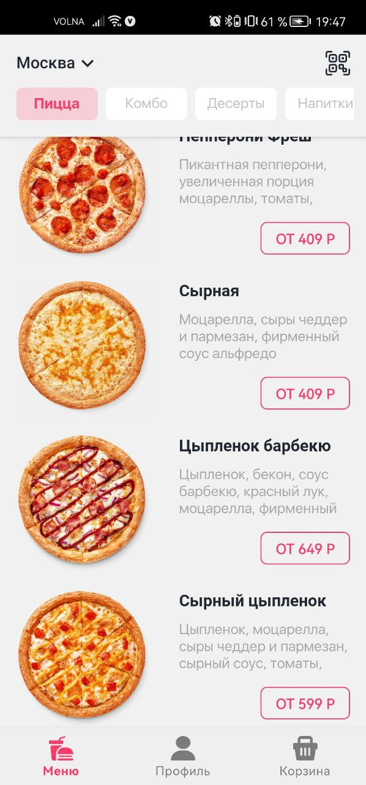
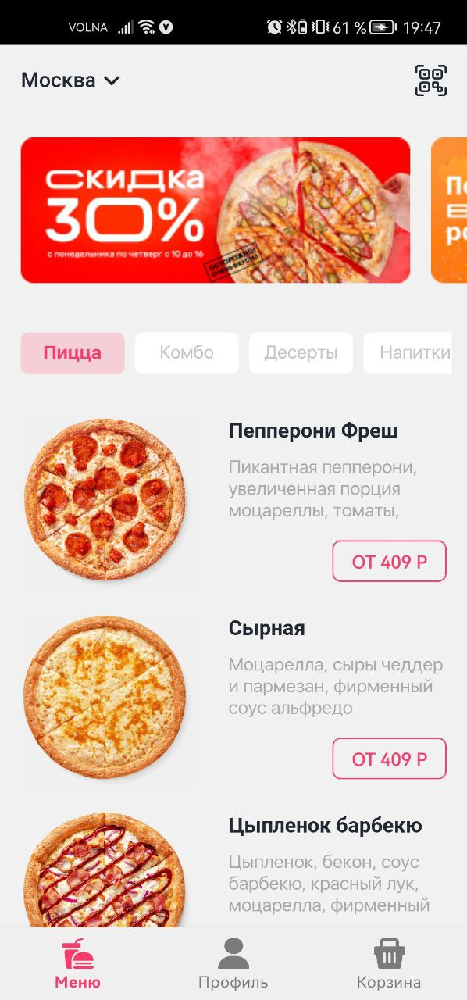

# Тестовый проект для "Hammer Systems"

## О проекте

Данный проект был разработан, как тестовое задание на вакансию Android разработчик.

### Что нужно было сделать:

- Разработать приложение по данному [дизайну](
  https://www.figma.com/file/8FvAWXCD2oD9oSDHx9xFfU/%D0%A2%D0%B5%D1%81%D1%82%D0%BE%D0%B2%D0%BE%D0%B5-%D0%B7%D0%B0%D0%B4%D0%B0%D0%BD%D0%B8%D0%B5-Android?node-id=0%3A1
  )
- В качестве API использовать любой открытый источник подходящий под текущие нужды.
  Я использовал API, который создал сам, с помощью
  сервиса [https://mockapi.io/](https://mockapi.io/).

## Технический стек:

- Kotlin
- Clean Architecture
- MVVM
- Многомодульность
- ViewBinding

### Библиотеки:

- Coroutines
- Lifecycle(LiveData, ViewModel)
- Navigation
- Glide
- TabSync
- Room
- Retrofit
- GSON
- OkHttp

## Скриншоты

    
    

 

